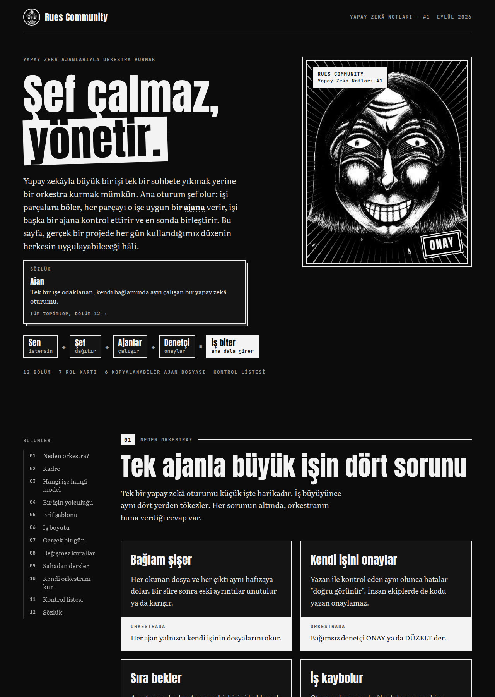
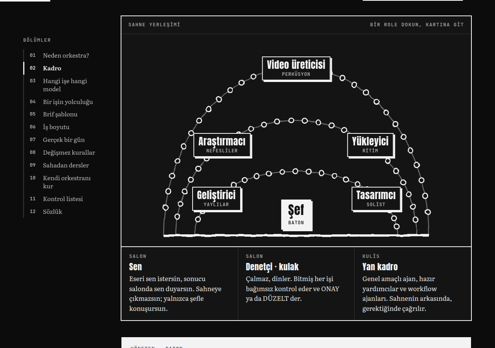

# Yapay Zekâ Orkestrası · Rues Community Yapay Zekâ Notları #1

> **Şef çalmaz, yönetir.** Büyük bir işi tek bir yapay zekâ sohbetine yıkmak yerine bir orkestra kur: ana oturum şef olur, işi uzman ajanlara böler, bağımsız bir denetçi kontrol eder, şef birleştirir.

**Sayfayı aç:** [`index.html`](index.html) — tek dosya, tarayıcıda doğrudan açılır. Açık ve koyu temayı destekler, telefonda da okunur.

## İçinde neler var

| Bölüm | Özet |
|---|---|
| Neden orkestra? | Tek ajanla büyük işin dört sorunu: bağlam şişer, kendi işini onaylar, sıra bekler, iş kaybolur |
| Kadro | Şef, yükleyici, araştırmacı, geliştirici, tasarımcı, video üreticisi, denetçi: her biri için model, neden o model, örnek işler, ne zaman kullanılmaz |
| Hangi işe hangi model | Haiku, Sonnet, Opus için iki soruluk karar akışı |
| Bir işin yolculuğu | İstekten yayına 7 adım, en fazla 3 turluk DÜZELT döngüsü |
| Brif şablonu | GÖREV · SENİN DOSYALARIN · DOKUNMA · ÖNCE OKU · BİTTİ TANIMI · RAPOR |
| Gerçek bir gün | Aynı gün paralel çalışan denetim, tasarım ve workflow ajanları |
| Değişmez kurallar | Para kuralı, uydurma yok, mutasyon kontrolü, tehlikeli git komutları |
| Sahadan dersler | Bitmeyen bekleme döngüsü, dolan disk, yeniden başlayan makine, denetçinin yakaladığı donma… |
| Kendi orkestranı kur | Kopyalanabilir ajan dosyaları, kontrol listesi, sözlük |

## Hazır ajan dosyaları

[`ajanlar/`](ajanlar) klasöründeki dosyaları kendi projende `.claude/agents/` altına kopyala (Claude Code):

| Dosya | Model | Rol |
|---|---|---|
| [`denetci.md`](ajanlar/denetci.md) | Sonnet (riskli işte Opus) | Başka ajanın işini bağımsız kontrol eder, ONAY / DÜZELT döner. İlk bunu kur. |
| [`gelistirici.md`](ajanlar/gelistirici.md) | Sonnet | Tarif edilmiş kod değişiklikleri ve testler |
| [`arastirmaci.md`](ajanlar/arastirmaci.md) | Sonnet | Kaynaklı araştırma; kod yazmaz |
| [`yukleyici.md`](ajanlar/yukleyici.md) | Haiku | Mekanik toplu işler |
| [`tasarimci.md`](ajanlar/tasarimci.md) | Opus | Görsel yargı gerektiren işler |
| [`video-ureticisi.md`](ajanlar/video-ureticisi.md) | Opus | Video ve ses; ölçerek doğrular |

Şefin kuralı için [`CLAUDE-orkestra-kurali.md`](ajanlar/CLAUDE-orkestra-kurali.md) içeriğini projendeki `CLAUDE.md` dosyasına ekle.

---
Rues Community · Eylül 2026 · Gerçek bir projede her gün kullanılan düzenden derlendi.
